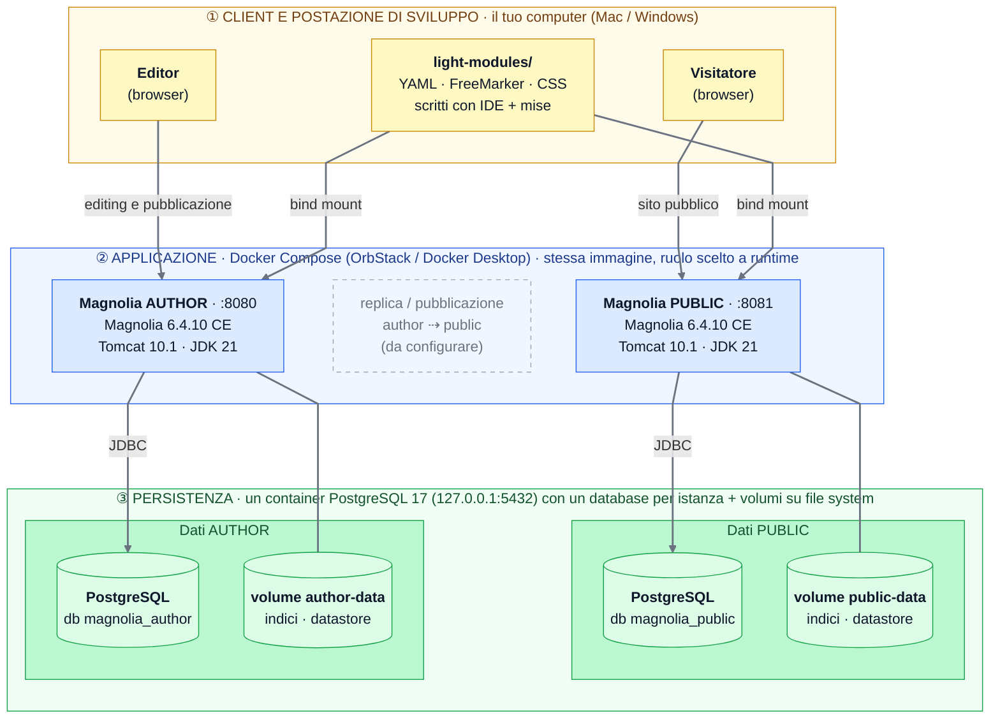
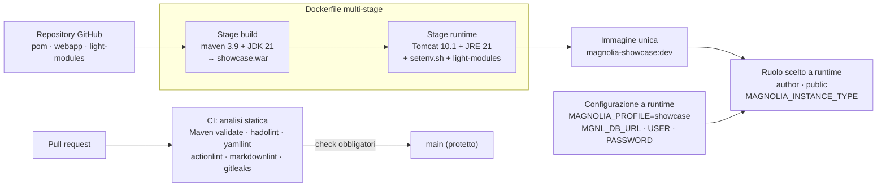

# Magnolia Showcase

Progetto dimostrativo per mostrare le potenzialità di [Magnolia CMS](https://www.magnolia-cms.com) (versione 6.4, Community Edition):
istanze **Author** e **Public** su **PostgreSQL**, un sito di media complessità sviluppato come *content as code*, esecuzione in
container (Docker, poi Kubernetes), test automatici, estensione di feature standard e un design system.

Gli obiettivi, le decisioni e il modo di lavorare sono in [AGENTS.md](AGENTS.md).

## Architettura

### A runtime



- **Tre layer**: client e postazione di sviluppo, applicazione (Docker Compose), persistenza.
- **Una sola immagine, due ruoli**: author e public sono lo stesso WAR; il ruolo si sceglie con `MAGNOLIA_INSTANCE_TYPE`.
- **Dati separati per istanza**: ognuna ha il proprio database PostgreSQL (nello stesso container) e il proprio volume
  con indici di ricerca e binari.
- **Light module montati dal tuo computer**: si modificano con l'IDE e Magnolia li legge dalla cartella montata.
- La **replica da author a public** (pubblicazione) è tratteggiata perché non è ancora configurata: è il prossimo passo.

### Dal codice all'immagine



Lo schema mostra solo ciò che esiste oggi. Kubernetes (Helm), i test end-to-end e il design system si aggiungeranno man mano
e saranno riportati qui.

## Requisiti

Il build usa JDK 21 e Maven **dentro il container**: per avviare il progetto serve solo **Docker** con Docker Compose v2.

- **macOS:** consigliato [OrbStack](https://orbstack.dev), un'alternativa leggera a Docker Desktop che
  include `docker` e `docker compose` (`brew install --cask orbstack`). Da OrbStack si vedono anche
  container, immagini e volumi del progetto e se ne aprono i log. Anche Docker Desktop funziona.
  Per toolchain e comandi si usa [mise](https://mise.jdx.dev) (`brew install mise`).
- **Windows:** Docker Desktop.

## Avvio in locale

Dalla radice del repository.

**macOS** (Terminale, con mise)

```bash
mise install      # una tantum: installa il JDK 21 definito in mise.toml
mise run up       # build + avvio di PostgreSQL, author e public
```

**Windows** (PowerShell, con Docker Desktop attivo)

```powershell
docker compose up -d --build
```

Su Mac `mise run up` esegue lo stesso `docker compose up -d --build`, quindi funziona anche senza mise.
La prima volta il build scarica circa 200 MB di dipendenze e richiede alcuni minuti. Gli avvii successivi
sono rapidi (circa 20 secondi). Provato su Mac con OrbStack; su Windows non ancora.

| Servizio | URL / indirizzo |
|---|---|
| Author | <http://author.localhost:8080/.magnolia/admincentral> |
| Public | <http://public.localhost:8081> |
| PostgreSQL | `localhost:5432` (solo da questo computer), vedi [Database](#database-postgresql) |

> **Usa `author.localhost` e `public.localhost`, non `localhost`.** Le due istanze sono sullo stesso computer con
> porte diverse, ma i cookie dei browser **non distinguono le porte**: con `localhost:8080` e `localhost:8081`
> entrambe scrivono un cookie `csrf` per lo stesso host e si sovrascrivono a vicenda. Il login fallisce allora con la
> pagina *"You are not authorized to access the requested resource… expired session"* (HTTP 403, nel log
> `Possible CSRF Attack. CSRF token not set`). Con nomi host diversi ogni istanza ha i propri cookie.
> I nomi `*.localhost` puntano a questo computer senza configurare nulla (verificati con `curl` e in un browser basato
> su Chromium; Safari e Firefox non verificati: in alternativa usa `127.0.0.1` per una delle due).
>
> **Se dopo il login vedi una schermata bianca** o l'errore precedente, il problema è nello stato salvato dal
> browser (cookie, dati del sito o estensioni): apri l'indirizzo in una **finestra in incognito**, oppure cancella i
> dati dei siti `localhost`, `author.localhost` e `public.localhost` e disattiva le estensioni. Il server risulta a
> posto: lo stesso login in un browser pulito apre l'Admincentral sia sull'author sia sulla public.

**Primo accesso.** Magnolia 6.4 mostra una pagina in cui impostare la password dell'utente `superuser`.
Va fatto una volta per istanza (author e public hanno dati separati), usando gli indirizzi qui sopra.

### Comandi utili

| Cosa | macOS (mise) | Windows / senza mise |
|---|---|---|
| Avvia | `mise run up` | `docker compose up -d --build` |
| Segui i log di tutto | `mise run logs` | `docker compose logs -f` |
| Segui solo i log dell'author | `mise run logs-author` | `docker compose logs -f --tail 100 author` |
| Segui solo i log della public | `mise run logs-public` | `docker compose logs -f --tail 100 public` |
| Accendi / spegni solo l'author | `mise run start-author` / `mise run stop-author` | `docker compose up -d author` / `docker compose stop author` |
| Accendi / spegni solo la public | `mise run start-public` / `mise run stop-public` | `docker compose up -d public` / `docker compose stop public` |
| Shell SQL sul database dell'author | `mise run db-author` | `docker compose exec postgres psql -U magnolia -d magnolia_author` |
| Shell SQL sul database della public | `mise run db-public` | `docker compose exec postgres psql -U magnolia -d magnolia_public` |
| Ferma e rimuove tutti i container (i dati restano) | `mise run down` | `docker compose down` |
| Riparte da zero (cancella anche i database) | `mise run reset` | `docker compose down -v` |
| Build locale del WAR, senza Docker | `mise run build` | `.\mvnw.cmd -B -DskipTests package` |

Spegnere un'istanza con `stop-…` non cancella né il container né i dati: `start-…` la riaccende dallo stato in cui
era (la password del `superuser` resta). Accendere una singola istanza avvia anche PostgreSQL, da cui dipende.
`mise tasks` elenca tutti i task. Il WAR del build locale è `webapp/target/showcase.war`.

## Database (PostgreSQL)

Il repository dei contenuti (Jackrabbit) usa **PostgreSQL 17** fin dalla prima installazione, al posto dell'H2
incluso in Magnolia (che la documentazione sconsiglia per la produzione). Ogni istanza ha il suo database, perché
author e public non devono condividere le tabelle di Jackrabbit:

| Istanza | Database |
|---|---|
| Author | `magnolia_author` |
| Public | `magnolia_public` |

I database vengono creati da [docker/postgres/01-create-databases.sql](docker/postgres/01-create-databases.sql) solo
quando il volume `pg-data` è vuoto (primo avvio, o dopo `mise run reset`).

**Credenziali di demo.** Utente `magnolia`, password `magnolia`: sono valori di demo e non vanno riusati altrove.
Per cambiarli copia [.env.example](.env.example) in `.env` e modifica `POSTGRES_USER`, `POSTGRES_PASSWORD` e
`POSTGRES_PORT`. La porta è esposta solo su `127.0.0.1`, per usare un client SQL a scelta dal tuo computer.
Gli indici di ricerca e i binari (datastore) restano su file nei volumi `author-data` e `public-data`.

**Come è configurato.**

- `MAGNOLIA_PROFILE=showcase` (impostato nel `Dockerfile`) attiva la cartella
  [webapp/src/main/webapp/WEB-INF/config/showcase](webapp/src/main/webapp/WEB-INF/config/showcase). Il suo
  `magnolia.properties` sovrascrive `magnolia.repositories.jackrabbit.config`, che punta a
  [jackrabbit-showcase-postgres.xml](webapp/src/main/webapp/WEB-INF/config/repo-conf/jackrabbit-showcase-postgres.xml).
  Quel file è la copia di quello fornito da Magnolia: cambia solo il `DataSource`, che legge URL e credenziali da
  proprietà di sistema.
- [docker/setenv.sh](docker/setenv.sh) converte le variabili d'ambiente `MGNL_DB_URL`, `MGNL_DB_USER` e
  `MGNL_DB_PASSWORD` in quelle proprietà. Il `docker-compose.yml` le imposta per ogni istanza e l'avvio fallisce subito
  se mancano.
- Il driver JDBC (`org.postgresql:postgresql`) non è nel BOM di Magnolia: la versione è fissata in `postgresql.version`
  nel `pom.xml` padre.

**Da sapere.**

- Le proprietà finiscono tra gli argomenti della JVM, quindi la password è visibile nei log di avvio di Tomcat. Va bene
  per una demo locale; per ambienti reali serviranno i *secret* (previsti con Kubernetes).
- Non si passa da H2 a PostgreSQL su un'installazione esistente: se hai già avviato una versione precedente del
  progetto, esegui `mise run reset` (o `docker compose down -v`) una volta, perdendo i dati.
- Cancellare solo il volume `pg-data` (e non `author-data` e `public-data`) lascia indici e datastore non allineati al
  database: per ripartire da zero usa sempre `reset`.

## Ciclo di sviluppo

Il runtime resta in Docker: l'IDE serve solo per scrivere i file e non devi far girare Tomcat dall'IDE.

| Cosa modifichi | Dove | Cosa succede |
|---|---|---|
| Template FreeMarker, dialog, CSS/JS, YAML | `light-modules/<modulo>/…` | La cartella è montata nel container e Magnolia la legge da `magnolia.resources.dir`. Secondo la [documentazione](https://docs.magnolia-cms.com/product-docs/6.2/developing/light-development-in-magnolia/) le modifiche sono rilevate senza riavvio: salvi e aggiorni il browser |
| Codice Java (moduli di estensione) | `modules/…` (in arrivo) | Va ricostruita l'immagine con `mise run up`: più lento, qualche minuto |
| Contenuti | Author (`:8080`) | Si modificano nell'editor visuale e si pubblicano sulla public. I contenuti demo verranno esportati in git come bootstrap |

Flusso tipico: scrivi nell'IDE, salvi, guardi la pagina sull'Author, la pubblichi, controlli la Public (`:8081`).

**Stato della verifica.** È verificato che la cartella `light-modules/` arrivi dentro il container. Il reload a caldo
vero e proprio non è ancora stato provato: lo verificheremo col primo light module del sito. Per lo sviluppo la
documentazione indica anche la proprietà `magnolia.develop=true`, che disattiva la cache delle risorse: non è ancora
impostata nel `docker-compose.yml`. Il debug del codice Java nel container richiederà una porta JDWP, anch'essa da aggiungere.

### Configurare l'IDE

In tutti gli IDE si apre la **cartella radice** del repository e si usa il JDK 21 di mise. Il percorso del JDK si
trova con `mise where java`.

#### IntelliJ IDEA

1. *File → Open* sulla radice: importa il progetto Maven dal `pom.xml`.
2. *Project Structure → SDK*: scegli il JDK 21 di mise, oppure aggiungilo indicando il percorso sopra.
3. Installa il plugin [YAML Assistant for IntelliJ](https://www.magnolia-cms.com/marketplace/detail/yaml-assistant-for-intellij.html)
   dal marketplace di Magnolia: autocompletamento dei parametri delle definizioni e riferimenti ai file cliccabili.

#### Visual Studio Code

1. *File → Open Folder* sulla radice.
2. Estensioni consigliate: *Extension Pack for Java* (imposta `java.configuration.runtimes` sul JDK di mise) e *YAML* di Red Hat.
3. Per l'autocompletamento YAML di Magnolia esistono gli schemi della community in
   [magnolia-community/definition-schemas](https://github.com/magnolia-community/definition-schemas), indicati per VS Code ed Eclipse.
   La mappatura dei file sugli schemi non è ancora verificata e non è inclusa nel progetto.

#### Eclipse

1. Usa la distribuzione *Eclipse IDE for Enterprise Java and Web Developers*.
2. *File → Import → Existing Maven Projects* sulla radice.
3. *Preferences → Java → Installed JREs*: aggiungi il JDK 21 di mise.
4. Per YAML e FreeMarker servono plugin dedicati (gli schemi della community indicano Eclipse tra gli IDE supportati).

Il supporto a FreeMarker negli IDE non è stato verificato.

## Versione di Java

Il progetto usa **Java 21**, definito in [mise.toml](mise.toml) (build locale) e nel `Dockerfile`
(`maven:3.9-eclipse-temurin-21` e `tomcat:10.1-jre21-temurin`). Magnolia 6.4 è certificato anche su Java 17 e
**Java 25 (LTS)**; il JDK 27 non è supportato.

Per passare a Java 25 (non ancora provato in questo progetto), secondo il
[certified stack](https://docs.magnolia-cms.com/product-docs/administration/certified-stack/):

- servono `javascript-models` 4.0.1 o superiore: il bundle 6.4.10 include già la 4.0.4;
- aggiungere ai `CATALINA_OPTS` i flag `-XX:+UnlockExperimentalVMOptions -XX:+EnableJVMCI`. Senza, GraalJS gira in
  modalità interpretata e nei log compare l'avviso *JVMCI isn't enabled*: il sistema funziona, ma le prestazioni
  peggiorano;
- cambiare `java = "temurin-25"` in `mise.toml`, le immagini nel `Dockerfile` (`eclipse-temurin-25`, `jre25`) e
  `maven.compiler.release` nel `pom.xml` padre; allargare di conseguenza il range del controllo `requireJavaVersion`
  (ora `[17,26)`, già compatibile con il 25).

## Struttura

```text
pom.xml              padre Maven (importa il BOM di Magnolia)
webapp/              WAR basato sulla webapp Community Edition (+ profilo `showcase` per PostgreSQL)
light-modules/       moduli "light" del sito (YAML, FreeMarker)
Dockerfile           build multi-stage: Maven/JDK 21 → Tomcat 10.1
docker-compose.yml   PostgreSQL + author + public
docker/              setenv.sh (variabili d'ambiente → JVM) e script SQL di init
mise.toml            JDK 21 e task (up, down, logs, reset, build)
```
